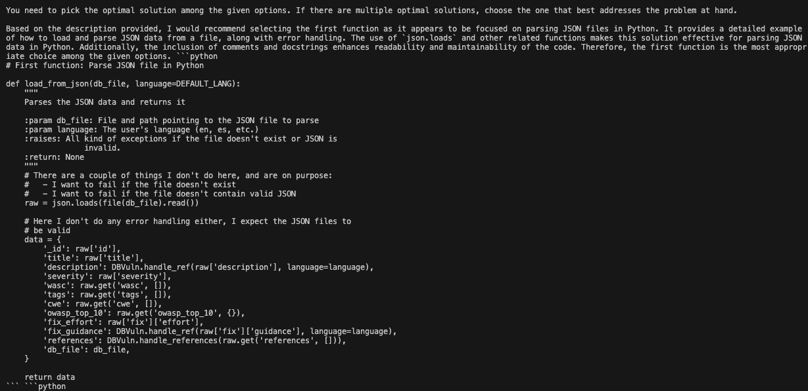

Code RAG leverages a **retrieval-augmented generation (RAG)** model to generate code based on your queries. Whether you're building from scratch or using pre-built images, this guide will help you get started with setting up and using Code RAG seamlessly.

## Dataset

We have used the CodeSearchNet dataset in this project. Please cite the following paper if you use the dataset:

```bibtex
@article{husain2019codesearchnet,
  title={{CodeSearchNet} challenge: Evaluating the state of semantic code search},
  author={Husain, Hamel and Wu, Ho-Hsiang and Gazit, Tiferet and Allamanis, Miltiadis and Brockschmidt, Marc},
  journal={arXiv preprint arXiv:1909.09436},
  year={2019}
}
```
For more information, visit the [CodeSearchNet GitHub repository](https://github.com/github/CodeSearchNet).
## Output

Here is the result for the query: **"write code to parse json file in python"**.




❗ This repository contains original coursework submitted for academic credit. Reuse, reproduction, or redistribution is prohibited without explicit permission.

Follow the instructions below to clone the repository, set up the Docker environment, and start generating code. **We recommend using Option 2**. Let's get started!

## Step 1: Clone the GitHub Repository  

Start by cloning the repository to your local machine. Open your terminal or Git CMD and run the following command:  

```bash
git clone https://github.com/ABDixit11/Code-RAG.git
``` 
## Step 2: Build the Docker Container on Your Local Machine(Option 1)  

The next step is to build the Docker container. This will automatically install all the required dependencies and set up the environment for the Code RAG model.  

Run the following command to build the Docker image:  
1. **Build docker image**:  
```bash
docker build -t coderag:latest .
```
2. **Run the docker container**:  
   Use the following command :  

```bash
   docker run -d --memory=10g --memory-swap=24g coderag:latest
```
3. **Get the Container ID**:  
   Use the following command to list all running containers:  

```bash
   docker ps
```

4. **Exec Into the Docker Container**
```bash
docker exec -it <container_id> bash
```
5. **Run shell script**
``` bash
./setup.sh
```
6. **Run python script**
``` bash
python coderag.py
```
7. **Write queries for code generation**
```bash
Generate a Python function to calculate the factorial of a number.
```

## Step 3: Use the Pre-Built Docker Image (Option 2)  

To save time, you can use the pre-built Docker image hosted on Docker Hub instead of building the image locally.  

Follow these steps to pull and run the pre-built image:  

### Step 3.1: Pull the pre-built image from Docker Hub:  

```bash
   docker pull adixit34/coderag-group-10:latest
```
### Step 3.2: Run the Docker Container  

After building or pulling the Docker image, run the following command to start the Docker container:  

```bash
docker run -d --memory=10g --memory-swap=24g coderag:latest
```
**Please wait until everything is loaded and ready to go.**


### Step 3.3: Enter a Query for Code Generation  

Now that you are inside the Docker container, you can interact with the Code RAG model. Simply type your programming query in the terminal, and the model will generate the desired code.  

For example, you can ask the model:  

```bash
Generate a Python function to calculate the factorial of a number.
```

## Contributors :
1) Abhijeet Dixit
2) Hrushikesh Mulavekar
3) Ritika Sarkar
4) Gunika Dhingra
5) Nithesh Gowda
6) Rachana Kumar
